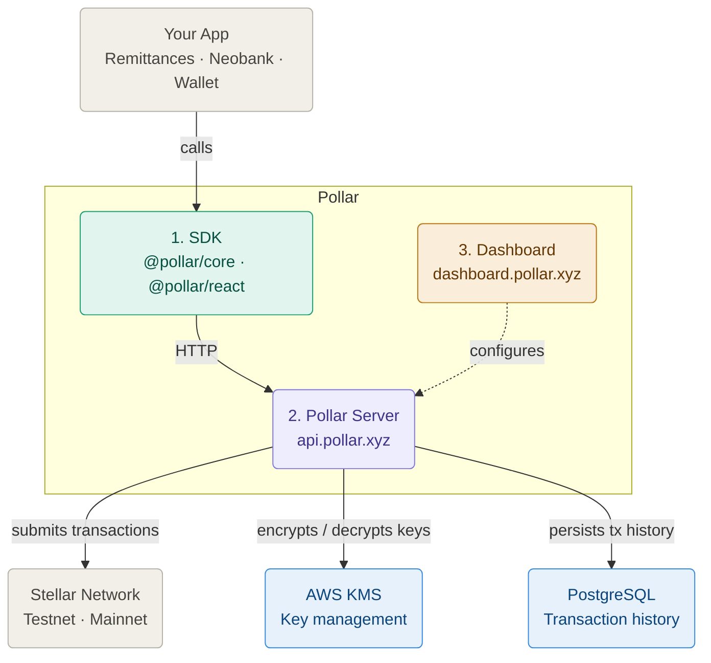
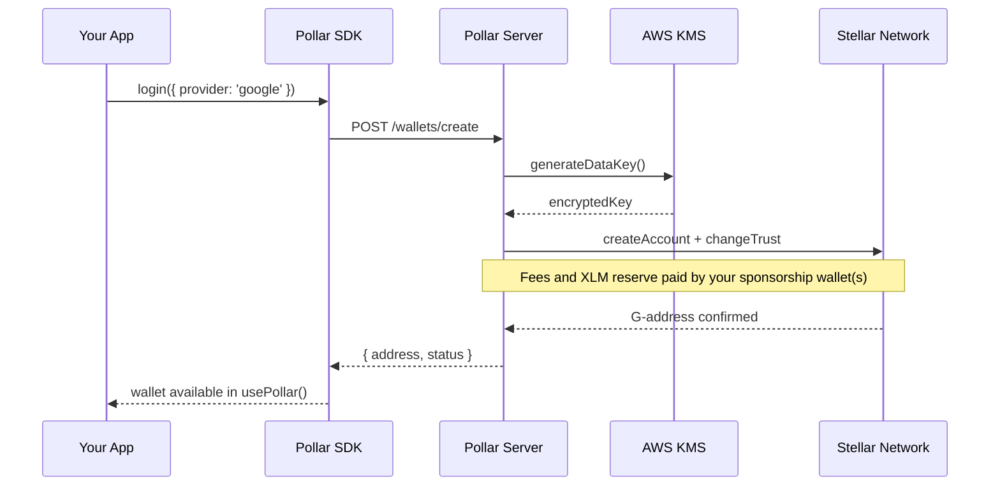

Pollar sits between your app and the Stellar network. This page explains how the three components interact and how requests flow from your frontend to the blockchain.

---

## The three components

| Component                                 | Runs where                                 | Your responsibility                                                |
| ----------------------------------------- | ------------------------------------------ | ------------------------------------------------------------------ |
| **SDK** (`@pollar/core`, `@pollar/react`) | Your frontend                              | Install and configure with your publishable key                    |
| **Pollar Server**                         | Hosted by Pollar at `api.pollar.xyz`       | Nothing — you call it via the SDK or REST API                      |
| **Dashboard**                             | Hosted by Pollar at `dashboard.pollar.xyz` | Configure your app settings, funding mode, and sponsorship wallets |

---

## Networks

| Network     | Pollar key prefix              | Notes                                               |
| ----------- | ------------------------------ | --------------------------------------------------- |
| **Testnet** | `pub_testnet_`, `sec_testnet_` | Development and testing. Free, resets periodically. |
| **Mainnet** | `pub_mainnet_`, `sec_mainnet_` | Production. Real XLM required.                      |

Futurenet is not supported by default. If your project requires it, [contact us](mailto:hello@pollar.xyz).

> Full details on Stellar networks at [developers.stellar.org/docs/networks](https://developers.stellar.org/docs/networks).

---

## App wallets

When you create an app in the Dashboard, Pollar provisions a set of Stellar accounts
that cover costs on behalf of your users — not user funds, but the infrastructure
costs of running wallets on Stellar. There are three distinct roles:

| Wallet                  | Covers                                       | Charged when               |
| ----------------------- | -------------------------------------------- | -------------------------- |
| **Funding wallet**      | XLM reserve for new user wallets             | Once per wallet activation |
| **Gas wallet**          | Transaction fees for all on-chain operations | Every transaction          |
| **Distribution wallet** | Assets sent via `fund()`                     | Every `fund()` call        |

By default a single wallet is created when you create your app and covers all three
roles. This is fine for development and early-stage apps.

As your app scales, separating them into three distinct wallets gives you independent
balance tracking, separate funding schedules, and tighter control over each cost
center. For example, your gas wallet gets topped up frequently in small amounts while
your funding wallet is replenished in larger batches tied to user growth. Mixing them
in a single wallet makes it harder to monitor and plan each cost independently.

For configuration and recommended minimum balances see
[Operator guide/Configuration/App Wallets](../operator-guide/configuration/app-wallets).

---

## Request lifecycle

What happens from the moment a user calls `login()` to the moment their wallet is ready:

For the deferred funding flow see [Funding Modes](./funding-modes.md).

---

## Security boundary

All private keys — user wallets and your app's sponsorship wallets — are managed through AWS KMS and never stored in plaintext anywhere in Pollar's infrastructure.

When the Pollar Server needs to sign a transaction, it requests a decryption from KMS. Every request leaves an immutable CloudTrail audit record.

By design, the Pollar Server can only:

- Sign fee-bump transactions (to cover transaction fees on behalf of users)

- Execute account sponsorship sequences (to fund new wallets)

The Pollar Server cannot move user funds — the sponsorship wallet only covers fees and XLM reserves and has no authority to transfer a user's assets.

For the full security model see [Security Model](./security-model).

---

## Data persistence

| Data                         | Where it lives    | Retention         |
| ---------------------------- | ----------------- | ----------------- |
| Transaction history (recent) | Stellar RPC       | 7 days            |
| Transaction history (full)   | Pollar PostgreSQL | Indefinite        |
| Encrypted private keys       | AWS KMS           | Per key lifecycle |
| App configuration            | Pollar PostgreSQL | Per app lifecycle |

The Pollar Server intercepts every fee-bump transaction it signs and persists it to PostgreSQL. Because Pollar processes all fee-bumps for your app, it has full visibility into your transaction history without indexing the entire blockchain.

For details on querying history see [Transaction History](./transaction-history).
