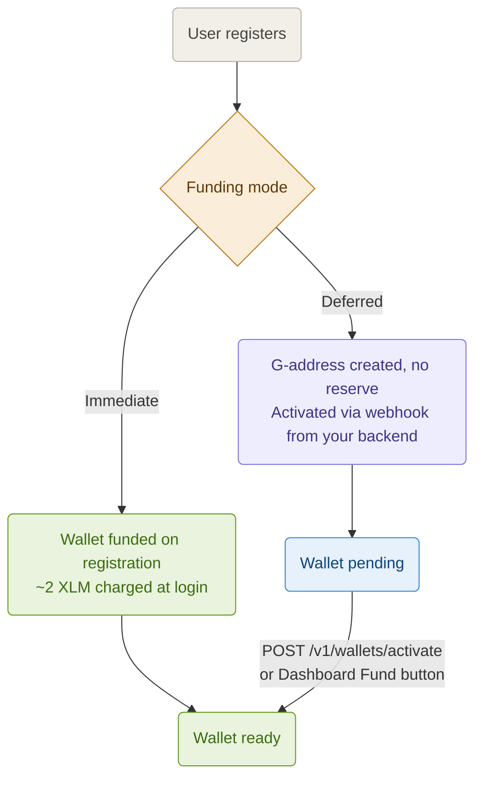

Every Stellar account requires a minimum XLM reserve to exist on-chain. Pollar gives you two modes to control exactly when that reserve is funded — so you only pay for users who matter to your app.

Configure the funding mode from **Dashboard → Treasury → Funding Mode**. No code changes required.

---

## The two modes



| Mode          | XLM cost                    | Activation trigger        | Best for                                      |
| ------------- | --------------------------- | ------------------------- | --------------------------------------------- |
| **Immediate** | \~2 XLM per registration    | Automatic on login        | Apps without compliance requirements          |
| **Deferred**  | \~2 XLM per activation only | Webhook from your backend | Neobanks, remittance apps, KYC-gated products |

In both modes, any individual wallet can also be activated manually from **Dashboard → Users → Wallets (Fund 2 XLM)**. This is useful as a fallback or for support workflows.

> **How the \~2 XLM is calculated:** Every Stellar account requires a base reserve of **1 XLM**. Each trustline (asset) you configure in the Dashboard adds **0.5 XLM**:
>
> `1 XLM + (number of configured assets × 0.5 XLM)`
>
> | Assets configured    | Reserve required |
> | -------------------- | ---------------- |
> | 0                    | 1 XLM            |
> | 1 (e.g. USDC)        | 1.5 XLM          |
> | 2 (e.g. USDC + EURC) | 2 XLM            |
> | 3                    | 2.5 XLM          |
>
> Pollar does not charge extra — the full amount is consumed from your funding wallet.
>
> References: [Minimum Balance](https://developers.stellar.org/docs/learn/fundamentals/lumens#minimum-balance) · [Trustlines](https://developers.stellar.org/docs/learn/fundamentals/stellar-data-structures/accounts#trustlines)

---

## Immediate

The wallet is funded atomically at the moment the user logs in. Ready in under 3 seconds. No additional setup required.

**Cost:** \~2 XLM per registration, including users who abandon onboarding.

```tsx
const { login, isAuthenticated } = usePollar();
await login({ provider: 'google' });
// once isAuthenticated is true, the wallet is funded and ready immediately
```

---

## Deferred

The G-address is created on-chain at registration but without an XLM reserve. The wallet exists but cannot transact until it is activated.

**Cost:** \~2 XLM only for users who complete activation. Zero cost for users who abandon.

This mode solves a problem unique to Stellar: every account needs a minimum XLM reserve to exist on-chain. Without deferred funding, an app with 10,000 users who abandon onboarding burns 20,000 XLM for nothing.

### Activating via webhook

Your backend calls `POST /v1/wallets/activate` when a business event occurs — KYC approved, first deposit, email verified, or any trigger you define.

```bash
POST https://api.pollar.xyz/v1/wallets/activate
x-pollar-api-key: sec_testnet_xxxxxxxxxxxxxxxxxxxx
Content-Type: application/json

{
  "publicKey": "GXXXXXXXXXXXXXXXXXXXXXXXXXXXXXXXXXXXXXXXXXXXXXXXXXXXXXXX"
}
```

> Never call this endpoint from the client. It requires your secret key and must run on your backend. See the [Server API](https://docs.pollar.xyz/docs/sdk-reference/server-api) reference.

**Response codes:**

| Code                      | Meaning                                              |
| ------------------------- | ---------------------------------------------------- |
| `200 OK`                  | Wallet activated. XLM reserve funded on-chain.       |
| `400 Bad Request`         | Missing or malformed `publicKey`.                    |
| `402 Payment Required`    | Funding wallet has insufficient XLM.                 |
| `404 Not Found`           | `publicKey` is not a wallet owned by your app.       |
| `409 Conflict`            | Wallet is already funded. Safe to ignore.            |
| `503 Service Unavailable` | Stellar network issue.                               |

### Funding manually from the Dashboard

Any not-yet-funded wallet can be funded from **Dashboard → Users → Wallets** with the **Fund 2 XLM** action. This works in both Immediate and Deferred mode and is useful for support workflows or one-off overrides.

### Checking whether a wallet is funded

The funded state is reflected on-chain. From an authenticated session you can read the wallet's balances — an unfunded wallet has no XLM reserve yet:

```tsx
const { walletBalance, refreshWalletBalance } = usePollar();

await refreshWalletBalance();
if (walletBalance.step === 'loaded') {
  // inspect walletBalance.data.balances to see if the reserve / assets are present
}
```

---

## Switching modes

You can switch funding modes at any time from the Dashboard without changing any code. The new mode applies to all wallets created after the switch. Existing wallets are not affected.

---

## Cost comparison

For an app with 10,000 registered users where 30% complete activation:

| Mode        | XLM spent        | Cost basis           |
| ----------- | ---------------- | -------------------- |
| Immediate   | \~20,000 XLM     | Every registration   |
| Deferred    | \~6,000 XLM      | Only activated users |
| **Savings** | **\~14,000 XLM** | <br />               |

The Dashboard shows a real-time cost breakdown per mode so you can optimize as your app grows.
