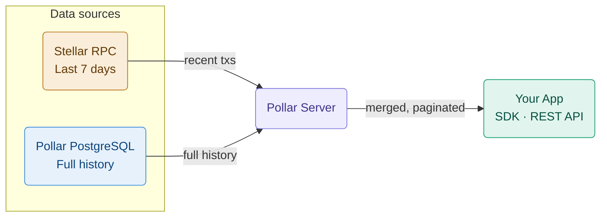

Pollar provides complete transaction history for every wallet through two complementary layers — one from the Stellar network and one from Pollar's own database.

---

## Two-layer architecture



| Layer  | Source            | Retention  |
| ------ | ----------------- | ---------- |
| Recent | Stellar RPC       | 7 days     |
| Full   | Pollar PostgreSQL | Indefinite |

The Pollar Server captures every transaction at fee-bump signing time and persists it to PostgreSQL. Because Pollar processes all fee-bumps for your app, it has full visibility without indexing the entire blockchain.

> Horizon (the older Stellar API) is formally deprecated by SDF. Pollar uses Stellar RPC exclusively.

---

## SDK — React hook

`txHistory` is a reactive state machine (`TxHistoryState`). Trigger a load with `fetchTxHistory()` on the underlying client; the provider keeps `txHistory` in sync.

```tsx
'use client';
import { useEffect } from 'react';
import { usePollar } from '@pollar/react';

export function TxHistory() {
  const { txHistory, getClient } = usePollar();

  useEffect(() => {
    getClient().fetchTxHistory({ limit: 20, offset: 0 });
  }, [getClient]);

  if (txHistory.step !== 'loaded') return <p>Loading...</p>;

  return (
    <ul>
      {txHistory.data.records.map((tx) => (
        <li key={tx.id}>
          {tx.summary} · {tx.status} · {new Date(tx.createdAt).toLocaleDateString()}
        </li>
      ))}
    </ul>
  );
}
```

> The simplest path is the built-in modal: call `openTxHistoryModal()` from `usePollar()`.

## SDK — Core client

```typescript
await pollar.fetchTxHistory({ limit: 20, offset: 0 });

const state = pollar.getTxHistoryState();
if (state.step === 'loaded') {
  console.log(state.data.records, state.data.total);
}
```

`fetchTxHistory` drives `TxHistoryState` (it does not return the records directly). Subscribe with `onTxHistoryStateChange` for updates.

---

## REST API

The end-user transaction history is served by the SDK API (publishable key + authenticated end-user session), not by the secret-key Server API:

```bash
GET https://sdk.api.pollar.xyz/v1/tx/history?limit=20&offset=0
```

> There is currently **no secret-key Server API endpoint** for wallet transaction history. Use the SDK (`fetchTxHistory`) from an authenticated session.

**Query parameters:**

| Parameter | Type     | Default | Description                          |
| --------- | -------- | ------- | ------------------------------------ |
| `limit`   | `number` | —       | Records per page.                    |
| `offset`  | `number` | `0`     | Offset for pagination.               |
| `network` | `string` | session | `testnet` or `mainnet`.              |

**Response (`content`):**

```json
{
  "records": [
    {
      "id": "tx_abc123",
      "hash": "a1b2c3d4...",
      "network": "testnet",
      "status": "SUCCESS",
      "operation": "payment",
      "feeXlm": "0.00001",
      "summary": "Sent 10.00 USDC",
      "createdAt": "2026-03-15T10:30:00Z"
    }
  ],
  "total": 42,
  "limit": 20,
  "offset": 0
}
```

---

## Pagination

History uses **offset-based** pagination. Increase `offset` by `limit` to page forward; `total` tells you when to stop.

```typescript
async function getAllTransactions() {
  const all = [];
  let offset = 0;
  const limit = 100;

  for (;;) {
    await pollar.fetchTxHistory({ limit, offset });
    const state = pollar.getTxHistoryState();
    if (state.step !== 'loaded') break;
    all.push(...state.data.records);
    offset += limit;
    if (offset >= state.data.total) break;
  }

  return all;
}
```

---

## Transaction status

Each record carries a `status` reflecting its lifecycle:

| Status    | Description                                  |
| --------- | -------------------------------------------- |
| `PENDING` | Built/submitted, not yet confirmed on-chain. |
| `SUCCESS` | Confirmed on-chain.                          |
| `FAILED`  | Rejected by Stellar.                         |

The human-readable `operation` and `summary` fields describe what the transaction did.

---

## Record type

```typescript
type TxHistoryRecord = {
  id: string;
  hash: string;
  network: 'testnet' | 'mainnet';
  status: 'PENDING' | 'SUCCESS' | 'FAILED';
  operation: string;
  feeXlm?: string;
  resultCode?: string;
  summary: string;
  createdAt: string; // ISO 8601
};
```
