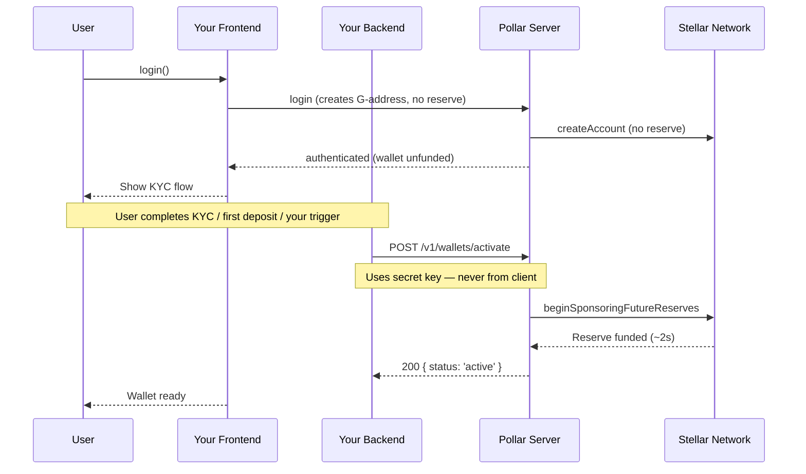

Deferred mode creates user wallets on-chain without funding them immediately. The XLM reserve is only charged when your backend calls `POST /v1/wallets/activate` — typically after a business event like KYC approval or a first deposit.

This guide walks through the full implementation end-to-end.

---

## Prerequisites

- Funding mode set to **Deferred** in **Dashboard → Treasury → Funding Mode**
- A secret key from **Dashboard → Build → API Keys**
- That's it — no additional dashboard configuration required

---

## How it works



---

## Step 1 — Gate unfunded wallets in the frontend

After login, decide whether to show your KYC/onboarding flow or the wallet UI. In Deferred mode the wallet exists but has no XLM reserve until activated — pass the user's `wallet.address` (their `G…` public key) to your KYC flow so your backend can activate it later.

```tsx
'use client';
import { usePollar } from '@pollar/react';

export function WalletGate() {
  const { isAuthenticated, wallet } = usePollar();

  if (!isAuthenticated) return <LoginButton />;

  // Track "has this user completed your business trigger?" in your own backend.
  // Until then, show the KYC/onboarding flow.
  return <KycFlow publicKey={wallet?.address} />;
}
```

---

## Step 2 — Trigger activation from your backend

When the business event occurs (KYC approved, first deposit confirmed, etc.), your backend calls `POST /v1/wallets/activate` using the **secret key** and the wallet's `publicKey`.

```typescript
// Your backend — e.g. Next.js API route, Express handler, webhook receiver
async function activateWallet(publicKey: string) {
  const response = await fetch('https://api.pollar.xyz/v1/wallets/activate', {
    method: 'POST',
    headers: {
      'x-pollar-api-key': process.env.POLLAR_SECRET_KEY!,
      'Content-Type': 'application/json',
    },
    body: JSON.stringify({ publicKey }),
  });

  if (!response.ok) {
    const { code } = await response.json(); // { code, success: false }
    throw new Error(`Activation failed: ${code}`);
  }

  return response.json();
  // { content: { publicKey, amount }, code: 'SERVER_WALLET_ACTIVATED', success: true }
}
```

> Never call this endpoint from the client. It requires your secret key — exposing it client-side compromises your entire app.

---

## Step 3 — Handle the response

| Code | Meaning | Action |
|---|---|---|
| `200 OK` | Wallet activated successfully | Proceed — wallet is funded on-chain |
| `400 Bad Request` | Missing or malformed `publicKey` | Check the request payload |
| `402 Payment Required` | Funding wallet has insufficient XLM | Top up via **Dashboard → Treasury → Account Funding** |
| `404 Not Found` | `publicKey` is not a wallet owned by your app | Verify the public key |
| `409 Conflict` | Wallet already funded | Safe to ignore — treat as success |
| `503 Service Unavailable` | Stellar network issue | Pollar retries automatically |

---

## Step 4 — Notify the frontend

After activation, notify your frontend so the UI updates. Your backend owns the "is this user activated?" signal, so the simplest approach is to poll your own endpoint; you can confirm on-chain by refreshing the wallet balance (an activated wallet now has its XLM reserve).

```tsx
'use client';
import { usePollar } from '@pollar/react';
import { useEffect, useState } from 'react';

export function KycFlow({ publicKey }: { publicKey: string }) {
  const { refreshWalletBalance, walletBalance } = usePollar();
  const [activated, setActivated] = useState(false);

  // Poll your own backend for the activation result, then refresh on-chain state.
  useEffect(() => {
    if (activated) return;
    const interval = setInterval(async () => {
      const done = await fetch('/api/activation-status').then(r => r.json());
      if (done.activated) {
        setActivated(true);
        await refreshWalletBalance();
      }
    }, 2000);
    return () => clearInterval(interval);
  }, [activated, refreshWalletBalance]);

  if (activated && walletBalance.step === 'loaded') {
    return <p>✓ Wallet activated</p>;
  }

  return <p>Complete KYC to activate your wallet...</p>;
}
```

---

## Full Next.js example

The [template-nextjs](https://github.com/pollar-xyz/template-nextjs) demo includes a working implementation:

- `app/api/activate/route.ts` — the API route that calls `POST /v1/wallets/activate`
- `app/components/KycGate.tsx` — the frontend component that triggers it

---

## Testing on testnet

1. Set funding mode to **Deferred** in the Dashboard
2. Log in — the wallet is created unfunded (no XLM reserve)
3. Call your activate endpoint manually (e.g. with curl or Postman)
4. Verify the wallet is now funded (it has its XLM reserve)
5. Verify the G-address on [Stellar Expert testnet](https://testnet.stellar.expert)

```bash
curl -X POST https://api.pollar.xyz/v1/wallets/activate \
  -H "x-pollar-api-key: sec_testnet_xxxxxxxxxxxxxxxxxxxx" \
  -H "Content-Type: application/json" \
  -d '{ "publicKey": "GXXXXXXXXXXXXXXXXXXXXXXXXXXXXXXXXXXXXXXXXXXXXXXXXXXXXXXX" }'
```