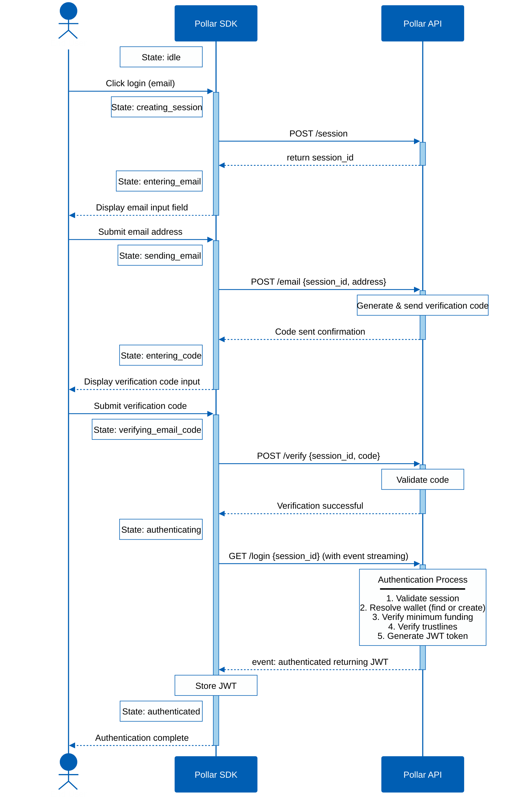

**Dashboard → Integrations → Authentication**

> 🚧 The per-app provider **configuration UI is upcoming** (the dashboard page is currently a "coming soon" stub). The providers below reflect what `login()` supports today.

Configure which authentication providers are available to your users.

---

## Supported providers

| Provider      | Type              | Setup required                       |
| ------------- | ----------------- | ------------------------------------ |
| **Google**    | OAuth 2.0         | None — Pollar handles the OAuth flow |
| **GitHub**    | OAuth 2.0         | None — Pollar handles the OAuth flow |
| **Email OTP** | One-time password | None — Pollar sends the OTP email    |
| **External wallet** | Freighter / Albedo built-in; more via adapters | Connects an existing Stellar wallet |
| **Discord** `upcoming` | OAuth 2.0 | Not yet supported by `login()`       |

Today `login()` accepts `google`, `github`, `email`, and any registered **wallet adapter** id. Freighter and Albedo are built-in (`login({ provider: WalletType.FREIGHTER })`); you can add every Stellar Wallets Kit wallet and Privy embedded wallets through the SDK's `walletAdapters` option — see [Wallet Adapters](https://docs.pollar.xyz/docs/sdk-reference/wallet-adapters). **Discord** (and other social providers such as Apple/X seen in config) are **not implemented yet** — they are inert until the provider work ships. Only enabled, supported providers appear in the `WalletButton` modal and are accepted by `login()`.

---

## Email OTP flow

### What the user sees at each state

| State                  | What the user sees                                                                   |
| ---------------------- | ------------------------------------------------------------------------------------ |
| `idle`                 | `WalletButton` — the login entry point                                               |
| `creating_session`     | `LoginModal` opens with a centered spinner and label "Initializing..."               |
| `entering_email`       | `LoginModal` shows an email input field and a "Continue" button                      |
| `sending_email`        | "Continue" button is disabled with an inline spinner — label changes to "Sending..." |
| `entering_code`        | `LoginModal` shows a 6-digit OTP input field and a "Verify" button                   |
| `verifying_email_code` | "Verify" button is disabled with an inline spinner — label changes to "Verifying..." |
| `authenticating`       | `LoginModal` shows a centered spinner and label "Authenticating..."                  |
| `authenticated`        | `LoginModal` shows a success message — closes automatically after a few seconds      |

---

## OAuth flow (Google, GitHub)

OAuth providers follow the standard authorization code flow. When `login({ provider: 'google' })` is called:

1. `LoginModal` opens briefly with a spinner — "Redirecting..."
2. The browser redirects to the provider's consent screen
3. After the user approves, the provider redirects back to your app
4. `LoginModal` reopens with a spinner — "Authenticating..."
5. The same five internal steps run (see below)
6. `LoginModal` shows a success message and closes

---

## What happens during authentication

After credentials are verified — whether via OTP code or OAuth callback — the Pollar API runs five steps before issuing the JWT:

1. **Validate session** — confirms the session ID is valid and not expired
2. **Resolve wallet** — finds the existing wallet for this user, or creates a new one on first login
3. **Verify minimum funding** — checks the wallet has the minimum XLM reserve (Immediate mode only)
4. **Verify trustlines** — ensures all assets configured in the Dashboard are enabled on the wallet
5. **Generate JWT** — issues a signed token that the SDK stores and uses for subsequent requests

This sequence is identical for all providers.

---

## Custom OAuth app `coming soon`

By default, Pollar uses its own OAuth credentials for Google and GitHub. You can configure your own OAuth app credentials for a fully branded experience — users will see your app name in the OAuth consent screen instead of Pollar's.
